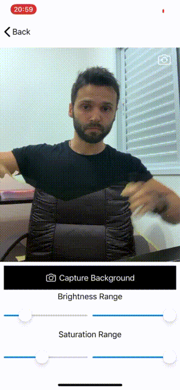

# Invisible Cloak
Invisible Cloak implemented on iOS with OpenCV

## Installation

After cloning, run the following:
```bash
carthage update
````
## How to use
Take a photo of the object containing the colors you want to segment


Select which colors you want to segment

Adjust the contrast and 


Have fun!



## Contributing
Pull requests are welcome. For major changes, please open an issue first to discuss what you would like to change.

Please make sure to update tests as appropriate.

## License
[MIT](https://choosealicense.com/licenses/mit/)
