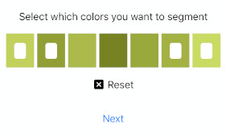

# Invisible Cloak
Invisible Cloak implemented on iOS with OpenCV

## Installation

After cloning, run the following:
```bash
carthage update
````
## How to use
### Take a photo of the object containing the colors you want to segment
<kbd>

</kbd>

### Select which colors you want to segment
<kbd>

</kbd>

### Place the camera at a fix and steady place. Take a photo of the background without you
<kbd>

</kbd>

### Adjust the brightness and contrast to achieve the best results.

### Have fun!

<kbd>

</kbd>


## Contributing
Pull requests are welcome. For major changes, please open an issue first to discuss what you would like to change.

Please make sure to update tests as appropriate.

## License
[MIT](https://choosealicense.com/licenses/mit/)
